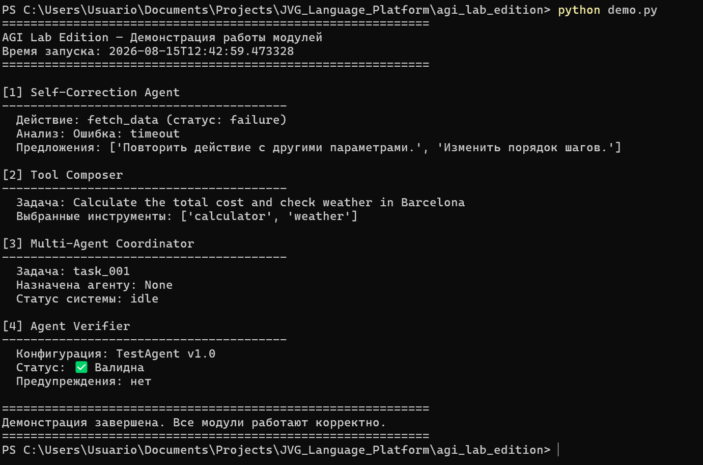

\# JOC Framework — AGI Lab Edition


\*\*Версия:\*\* v2.0-agi-lab  

\*\*Ветка:\*\* `feat/agi-lab-edition`  

\*\*Цель:\*\* Адаптация JOC Framework под исследовательские задачи Amazon AGI Lab.


\---


\## Целевые темы AGI Lab


1\. \*\*Self-Correcting Agents\*\* — механизмы рефлексии, самооценки и верификации цепочек рассуждений.

2\. \*\*Tool-Use and API Orchestration\*\* — автоматическая композиция инструментов для решения комплексных задач.

3\. \*\*Multi-Agent Coordination\*\* — координация нескольких агентов для достижения общей цели.

4\. \*\*Verification and Safety Guarantees\*\* — проверка ограничений до и во время выполнения.


\---


\## Структура


\- `/modules` — основные модули JOC, адаптированные под AGI Lab.

\- `/examples` — примеры конфигураций для каждой из 4 тем.

\- `/tests` — тесты для верификации модулей.

\- `/docs` — документация по интеграции с Amazon Bedrock Agents.


\---


\## Как использовать


1\. Установи зависимости (см. `requirements.txt` в корне).

2\. Запусти генерацию конфигурации:

&#x20;  ```bash

&#x20;  python run\_agi\_pipeline.py --topic self\_correction

Получи JSON-конфигурацию, совместимую с Amazon Bedrock Agents.


Статус

□ Self-Correction Module

□ Tool Composition Module

□ Multi-Agent Coordination Module

□ Verification Module

□ Примеры для всех 4 тем

□ Интеграция с Amazon Bedrock Agents

□ Документация


## 📸 Демонстрация


